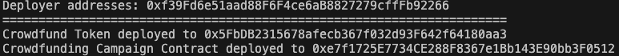
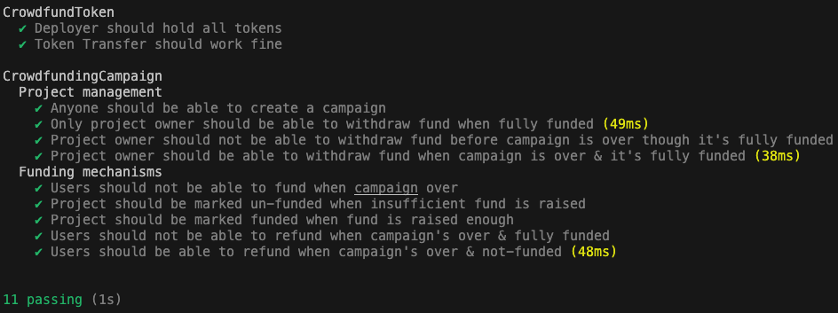

# Crowdfunding Campaign using ERC20 Tokens

This project implements a crowdfunding platform using Solidity smart contracts and ERC20 tokens. Project owners can create crowdfunding campaigns, users can fund these campaigns, and project owners can withdraw funds if their campaigns reach their funding goals.

## Table of Contents

- [Getting Started](#getting-started)
  - [Prerequisites](#prerequisites)
  - [Installation](#installation)
- [Deploying Contracts](#deploying-contracts)
- [Testing](#testing)
- [Security](#security)
- [Built With](#built-with)
- [License](#license)

## Getting Started

These instructions will help you set up the project on your local machine for development and testing purposes.

### Prerequisites

Ensure you have the following software installed on your machine:

- Node.js v12.0+ and npm
- Hardhat v2.0+ (for development and testing)
- An Ethereum wallet such as Metamask

### Installation

1. Clone the repository:
```bash
git clone https://github.com/salahawk/crowdfunding-erc20.git
```

2. Navigate to the project directory and install the dependencies:
```bash
cd crowdfunding-erc20
npm install
```

## Deploying Contracts

1. Create a `.env` file in the project root and add your wallet's private key and an Ethereum network RPC URL: (Optional: not required if you want to test only)
```bash
PRIVATE_KEY=your-private-key
RPC_URL=your-rpc-url
```

2. In the project directory, compile the smart contracts:
```bash
npx hardhat compile
```

3. Deploy the smart contracts to your desired Ethereum network: (or you can deploy locally without specifying the network)
```bash
npx hardhat run --network <network-name> scripts/deploy.js
```
Replace `<network-name>` with the name of the network you want to deploy to, such as `mainnet`, `goerli`, or `localhost`.

Here's the result of deployment on my end:



## Testing

To run tests on the smart contracts, execute the following command in the project directory:
```bash
npx hardhat test
```

Here's the test result (on my end):



## Security

The smart contracts have been reviewed for security issues, and the code has been analyzed using Slither. However, it's important to conduct a thorough audit before deploying contracts to a production environment.

## Built With

- [Solidity](https://soliditylang.org/) - Smart contract programming language
- [Hardhat](https://hardhat.org/) - Ethereum development environment
- [OpenZeppelin Contracts](https://github.com/OpenZeppelin/openzeppelin-contracts) - Reusable Solidity components

## License

This project is licensed under the MIT License - see the [LICENSE](LICENSE) file for details.
